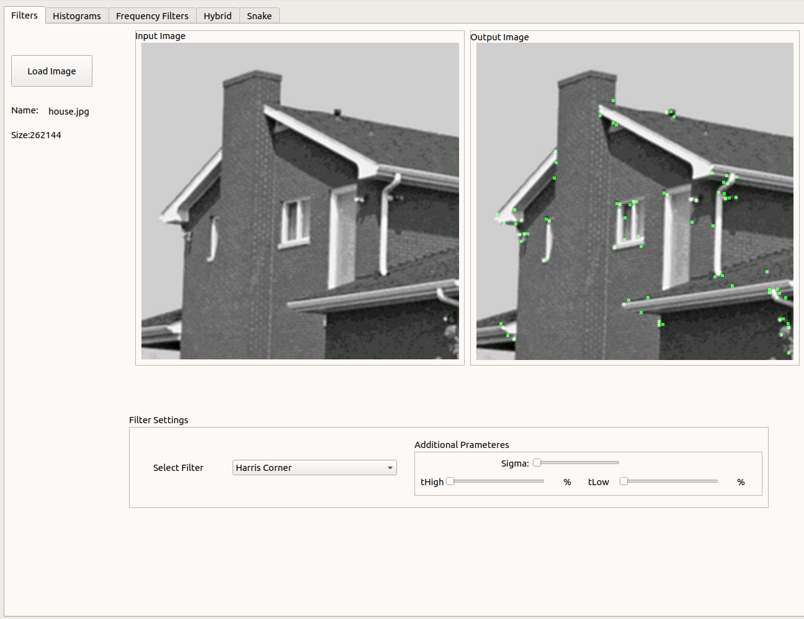
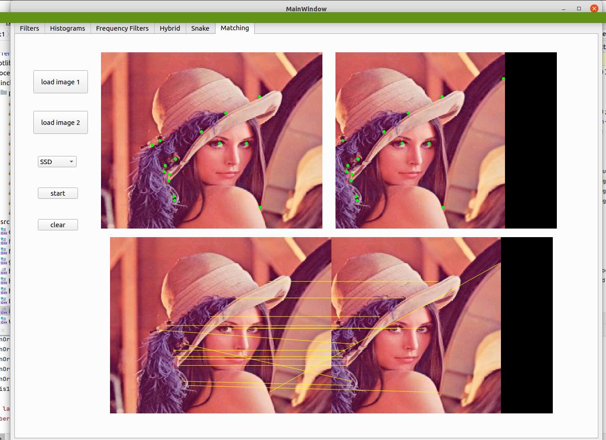
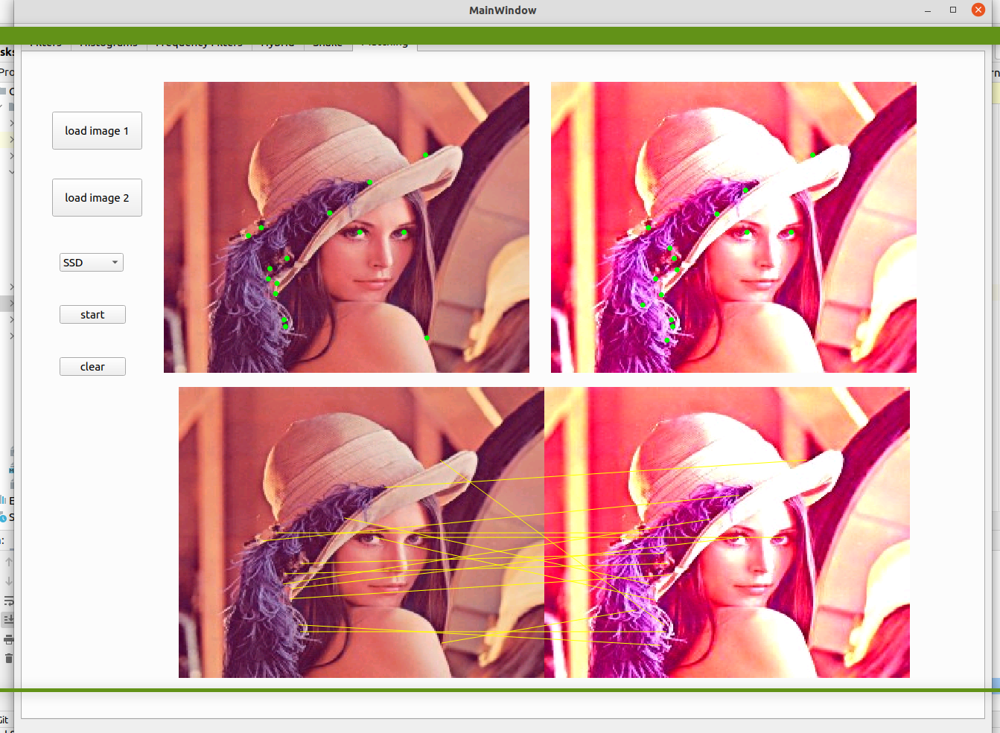
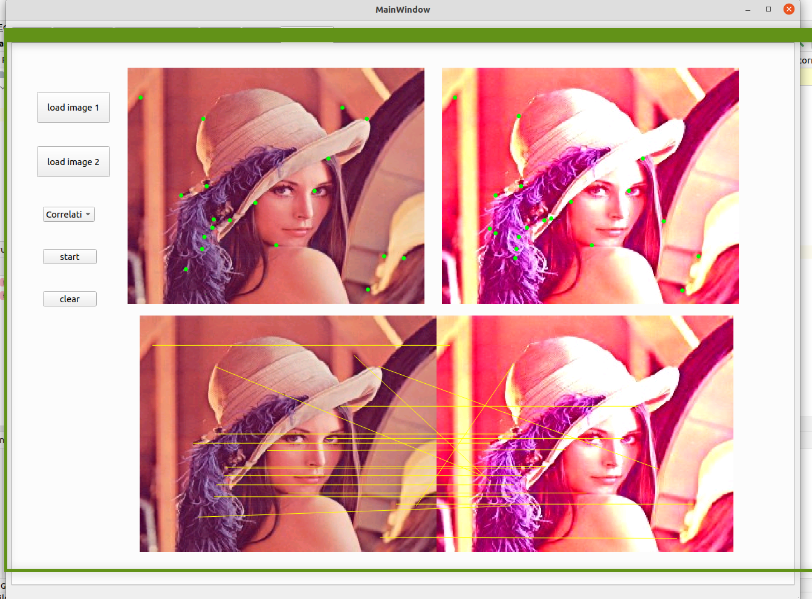

# Task 3
### Haris Operator
```c++
std::vector<_Point> cornerHarris(Image& grayImg, double threshold, int patchDim = 3)
```
Parameters:
* Grayscale image
* Threshold(0 -> 1) which is percentage of max of haris operator
* Patch dimension to construct hessian matrix at each pixel<br>
it uses internally ```void getHarrisCorner(Image &pointsStrength, std::vector<_Point> &cornerPoints, double threshold) ```
which get the points that greater than threshold
<br>
Complexity: O(imgWidth x imgHeight)


### SIFT Descriptor
```c++
std::vector<std::pair<std::vector<double>, _Point>> getSIFTDescriptor(Image &inputImg, float threshold = 0.01)
```
Parameters: 
* Grayscale image
* Threshold(0 -> 1) which passed to `cornerHarris`

Returns: 
vector of pair, each pair if 128-length vector and its associated point

Steps:
* get main orientation of pixel `std::vector<double>
  getMainOrientation(Image &dir, Image &magnitude, std::pair<int, int> iRange, std::pair<int, int> jRange)` 
  construct histogram of 36 bin in neighborhood of the pixel and take all orientations that greater than 0.8 * (max orientation)
* for each main orientation construct 16 x 16 neighborhood for each 4 x 4 region make histogram of 8 bin (of relative orientations) and store this histogram in the feature vector
 `void featureHistogram(Image &dir, Image &magnitude, double mainOrientation, std::pair<int, int> iRange, std::pair<int, int> jRange, std::vector<double> &v)`
* normalize the feature vector

Complexity: O(n^2)

### SSD Matching
```c++
std::vector<double> SSDMatching(Image& inputImage_1, Image& inputImage_2);
```
Parameters:
* Grayscale image (first image)
* Grayscale image (second image)

Returns:
vector of points that match

Steps:
* get FIST descriptor of both images
* loop over the descriptor of the first image and  inside this loop 
  , loop over the descriptor of the second image
* calculate the SSD between the key point of the first image and all the key points 
  of the second image
* get the 2 least SSD points and make sure that the least point is less than 0.8 * the second least point 
* put the points in the vector
* return the vector holding the points

Complexity: O(n^2)

### Normalized Correlation Matching
```c++
std::vector<double> normalizedCorrelation(Image& inputImage_1, Image&inputImage_2);
```
Parameters:
* Grayscale image (first image)
* Grayscale image (second image)

Returns:
vector of points that match

Steps:
* get FIST descriptor of the 2 images
* loop over the FIST descriptor of the 2 images and get the average of the vector of each key point 128 vector and store it
* loop over the descriptor of the first image and  inside this loop
  , loop over the descriptor of the second image
* calculate the Normalized Correlation between the key point of the first image and all the key points
  of the second image
* put the points in the vector
* return the vector holding the points

Complexity: O(n^2)

## Result



## Requirement packages git
* fftw3
* qt5
* cmake

## How to Run
linux os:
* mkdir build
* cd build 
* cmake ..
* make 

