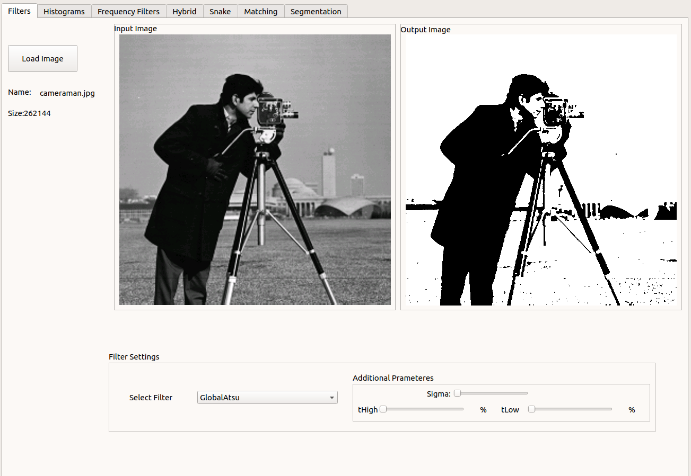
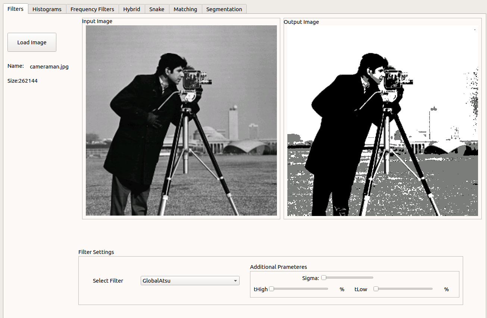
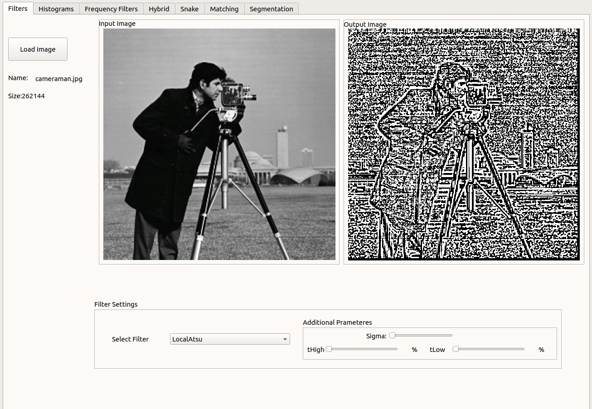
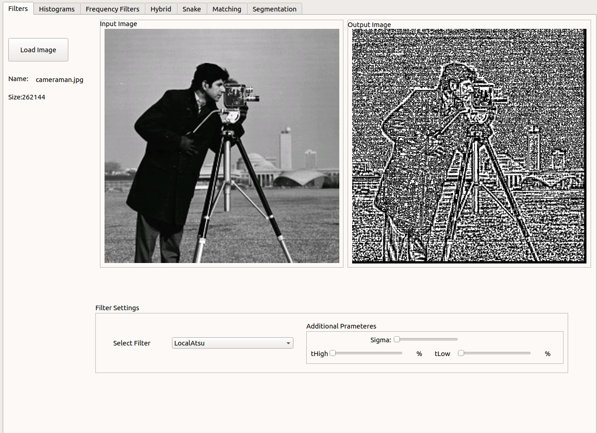
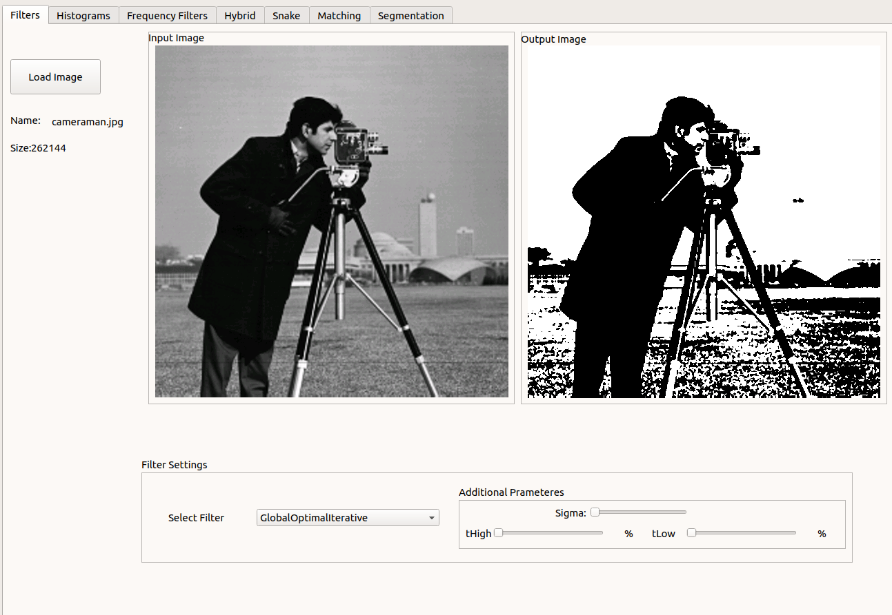
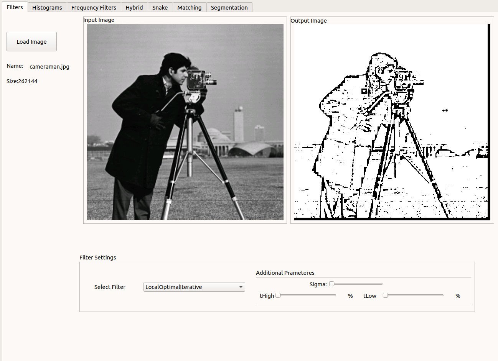
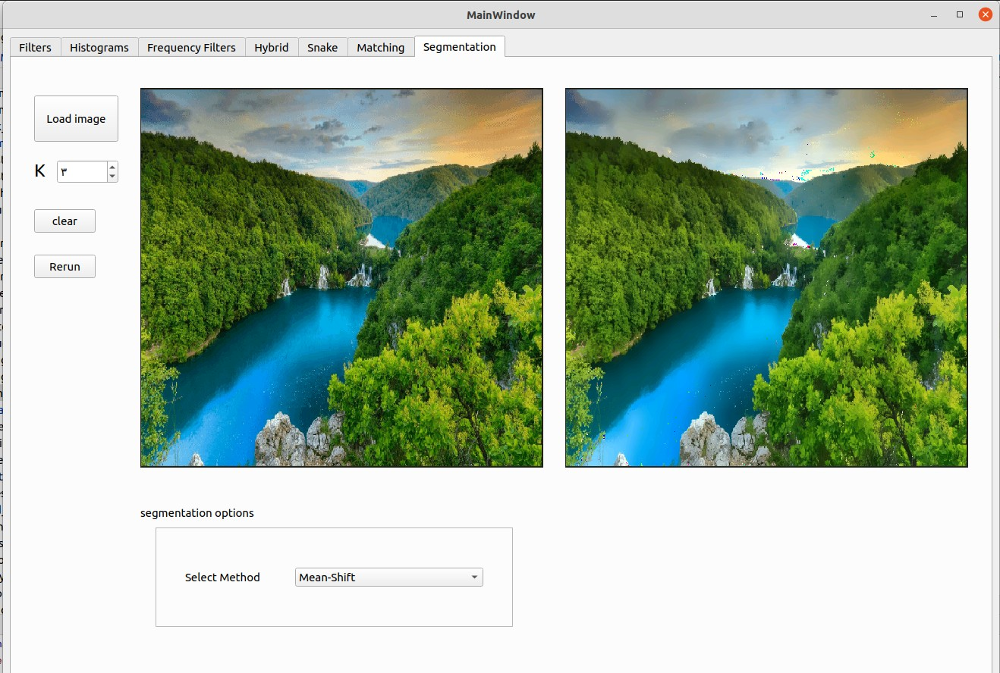
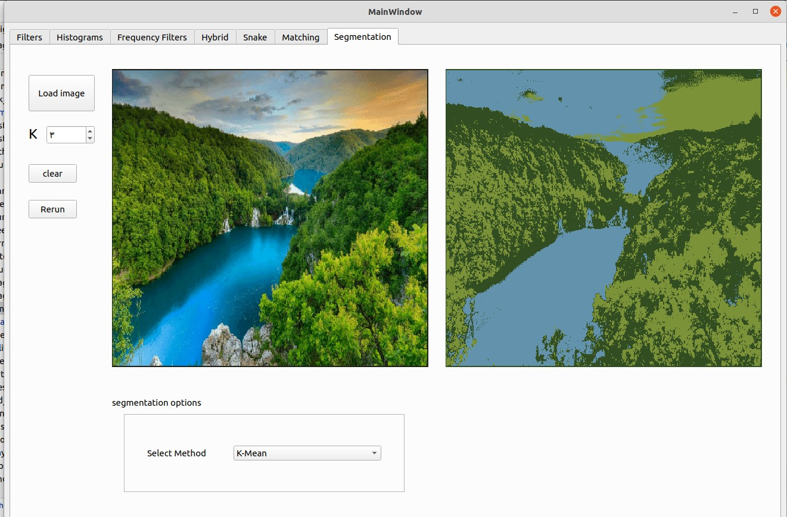

# Task 4
### Thresholding
##### Global Atsu
```c++
std::vector<int> globalAtsu(Image &inputImg, int histSize = 256, int numModes = 2);
```
function parameters:
  * inputImg: reference to gray Image
  * histSize: histogram size depending on the number of bits that represent each pixel in the image
  * numModes: number of modes

function return: return array of thresholds depending on number of modes

**Results**:<br>
* global atsu 2 modes

  
* global atsu 3 modes


##### Local Atsu
```c++
Image localAtsu(Image &inputImg, int blockDim, int histSize = 256, int numModes = 2);
```
function parameters:
* inputImg: reference to gray Image
* blockDim: block dimension (eg, 5 means 5 x 5)
* histSize: histogram size depending on the number of bits that represent each pixel in the image
* numModes: number of modes

<<<<<<< HEAD
Returns: 
vector of pair, each pair if 128-length vector and its associated _Point
=======
function return: return the thresholded image
>>>>>>> ba9f55b7f878d97767fbdd6b796ec1d72e5857db

**Results**:<br>
* local atsu 2 modes, blockDim: 5


* local atsu 3 modes, blockDim: 5

##### Global Optimal Iterative Thresholding

```c++
int globalOptimalIterativeThresholding(Image &inputImg);
```
function parameters:
   * inputImg: reference to gray Image 

<<<<<<< HEAD
Steps:
* get FIST descriptor of both images
* loop over the descriptor of the first image and  inside this loop 
  , loop over the descriptor of the second image
* calculate the SSD between the key _Point of the first image and all the key points 
  of the second image
* get the 2 least SSD points and make sure that the least _Point is less than 0.8 * the second least _Point 
* put the points in the vector
* return the vector holding the points
=======
function return: return threshold
>>>>>>> ba9f55b7f878d97767fbdd6b796ec1d72e5857db

 **Results**:<br>


##### Local Optimal Iterative Thresholding
```c++
Image localOptimalIterativeThresholding(Image &inputImg, int blockDim);
```
<<<<<<< HEAD
Parameters:
* Grayscale image (first image)
* Grayscale image (second image)

Returns:
vector of points that match

Steps:
* get FIST descriptor of the 2 images
* loop over the FIST descriptor of the 2 images and get the average of the vector of each key _Point 128 vector and store it
* loop over the descriptor of the first image and  inside this loop
  , loop over the descriptor of the second image
* calculate the Normalized Correlation between the key _Point of the first image and all the key points
  of the second image
* put the points in the vector
* return the vector holding the points
=======
function parameters:
* inputImg: reference to gray Image
* blockDim: block dimension (eg, 5 means 5 x 5)
>>>>>>> ba9f55b7f878d97767fbdd6b796ec1d72e5857db

function return: return threshold

**Results**:<br>
blockDim: 7


##### Means-Shift
```c++
MeanShift(Image *image, float hs, float hr)
```
class functions:
* ```c++ float distance(int i1, int j1, int i2, int j2```
* ```c++ float distance(vector<float> pt1, vector<float> pt2)```
* ```c++ Image run()```


**Results**:<br>
blockDim: 7


##### K-Mean
```c++
K_mean(Image *image, int k, int maxIteration)
```
class functions:
* ```c++ void clusterPixels()```
* ```c++ int closestCluster(int i, int j)```
* ```c++ void getClustersCentroid()```
* ```c++ bool centroidsChanged(vector<vector<float>> oldCentroids)```
* ```c++ float distance(int i, int j, vector<float> centroid)```
* ```c++ void run()```
* ```c++ K_mean()```
* ```c++ Image getOutput()```

**Results**:<br>
blockDim: 7


## Requirement packages git
* fftw3
* qt5
* cmake

## How to Run
linux os:
* mkdir build
* cd build 
* cmake ..
* make 

