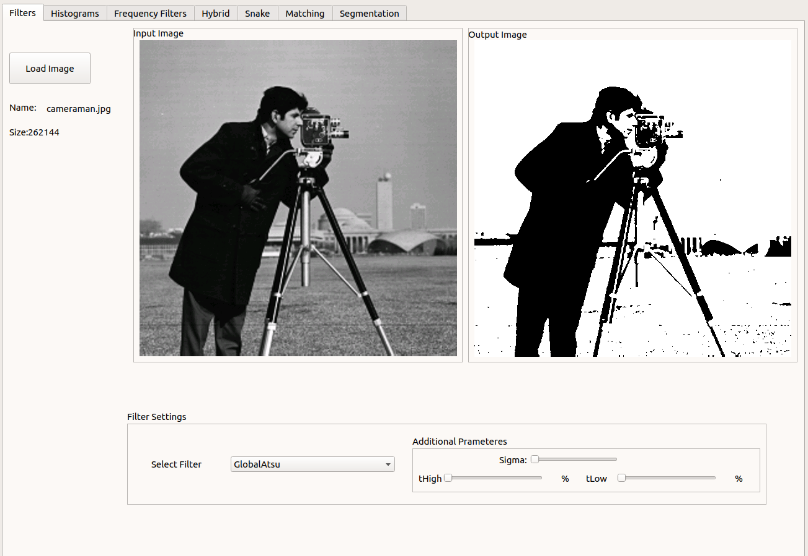
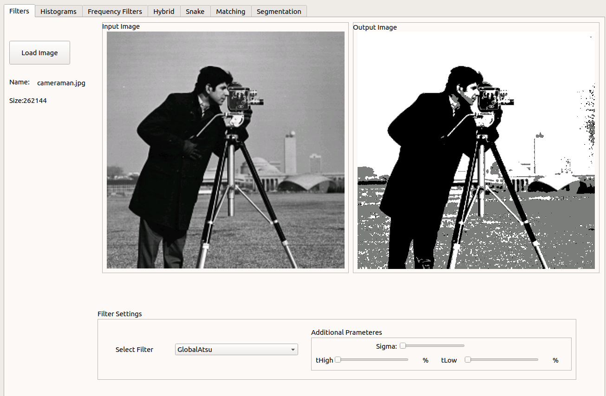
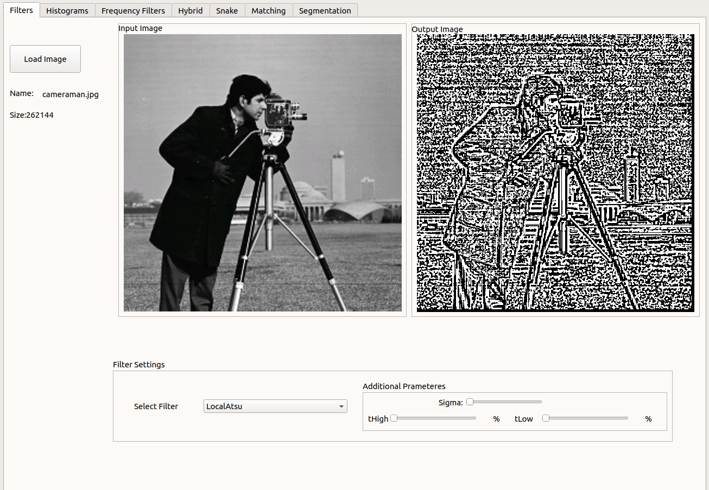
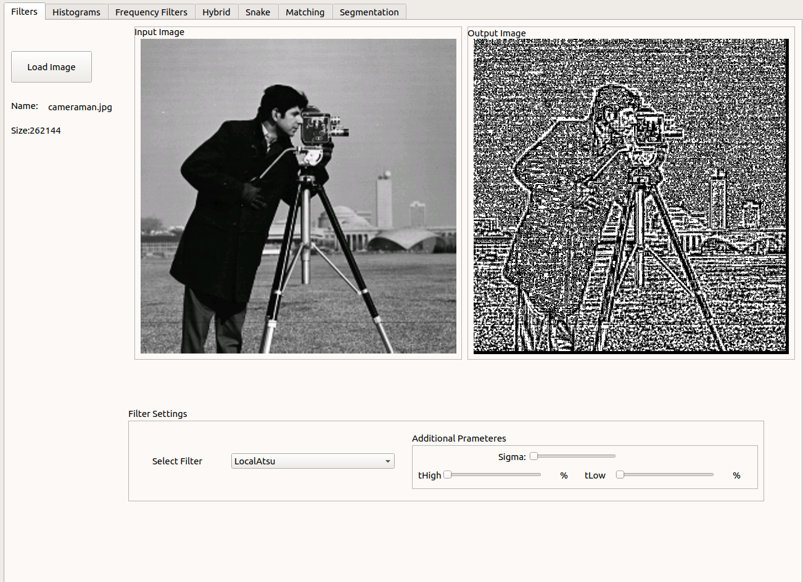
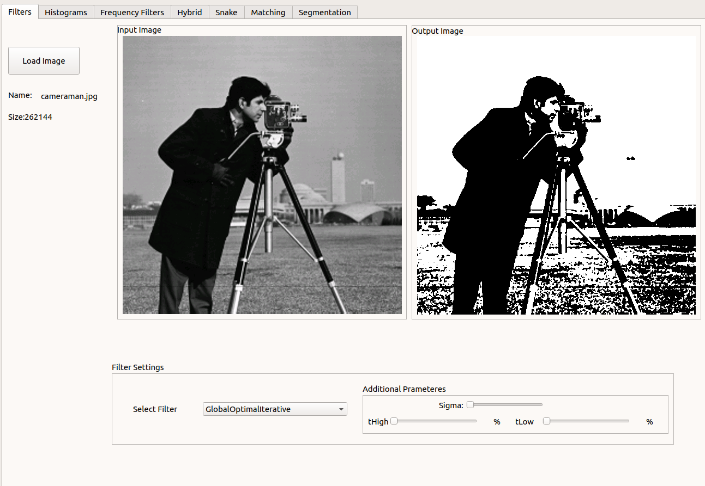
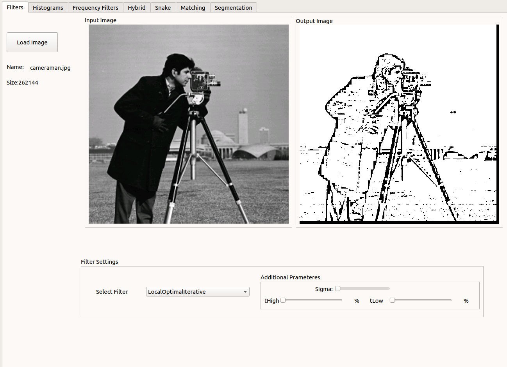

# Task 4
### Thresholding
##### Global Atsu
```c++
std::vector<int> globalAtsu(Image &inputImg, int histSize = 256, int numModes = 2);
```
function parameters:
  * inputImg: reference to gray Image
  * histSize: histogram size depending on the number of bits that represent each pixel in the image
  * numModes: number of modes

function return: return array of thresholds depending on number of modes

**Results**:<br>
* global atsu 2 modes

  
* global atsu 3 modes


##### Local Atsu
```c++
Image localAtsu(Image &inputImg, int blockDim, int histSize = 256, int numModes = 2);
```
function parameters:
* inputImg: reference to gray Image
* blockDim: block dimension (eg, 5 means 5 x 5)
* histSize: histogram size depending on the number of bits that represent each pixel in the image
* numModes: number of modes

function return: return the thresholded image

**Results**:<br>
* local atsu 2 modes, blockDim: 5


* local atsu 3 modes, blockDim: 5

##### Global Optimal Iterative Thresholding

```c++
int globalOptimalIterativeThresholding(Image &inputImg);
```
function parameters:
   * inputImg: reference to gray Image 

function return: return threshold

 **Results**:<br>


##### Local Optimal Iterative Thresholding
```c++
Image localOptimalIterativeThresholding(Image &inputImg, int blockDim);
```
function parameters:
* inputImg: reference to gray Image
* blockDim: block dimension (eg, 5 means 5 x 5)

function return: return threshold

**Results**:<br>
blockDim: 7


##### Means-Shift
```c++
MeanShift(Image *image, float hs, float hr)
```
class functions:
* ```c++ float distance(int i1, int j1, int i2, int j2```
* ```c++ float distance(vector<float> pt1, vector<float> pt2)```
* ```c++ Image run()```


**Results**:<br>
blockDim: 7


##### K-Mean
```c++
K_mean(Image *image, int k, int maxIteration)
```
class functions:
* ```c++ void clusterPixels()```
* ```c++ int closestCluster(int i, int j)```
* ```c++ void getClustersCentroid()```
* ```c++ bool centroidsChanged(vector<vector<float>> oldCentroids)```
* ```c++ float distance(int i, int j, vector<float> centroid)```
* ```c++ void run()```
* ```c++ K_mean()```
* ```c++ Image getOutput()```

##### Region Growing
```c++
Image RGSegmentation(Image & inputImg, std::vector<point> seedPoint)
```
function parameters:
* parameter

function return: return threshold
**Results**:<br>
blockDim: 7


##### Agglomerative
```c++
Image agglomerativeSeg(Image & img, int numOfClusters, unsigned long initialClustersNum)
```
function parameters:
* parameter

function return: return threshold
**Results**:<br>
blockDim: 7


## Requirement packages git
* fftw3
* qt5
* cmake

## How to Run
linux os:
* mkdir build
* cd build 
* cmake ..
* make 

