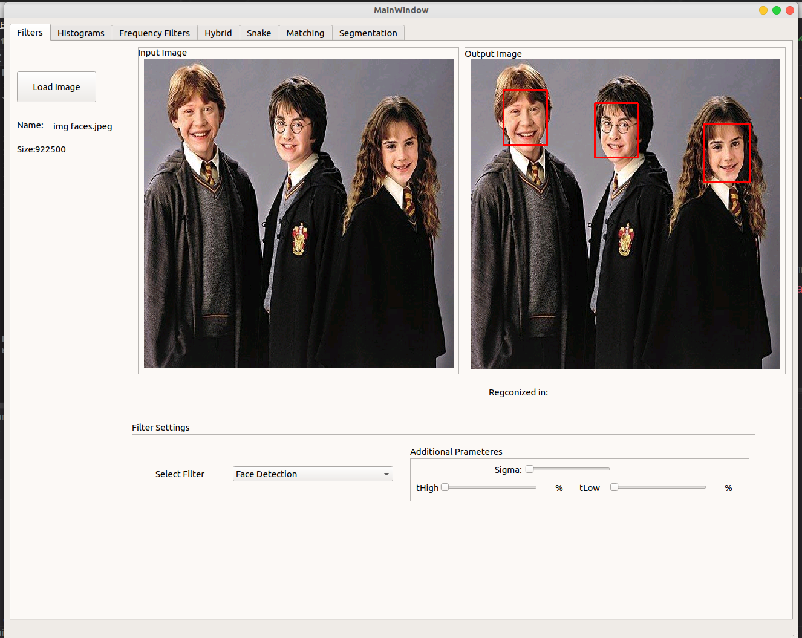

# Task 5
### Face Detection and Recognition
##### Face Detection
```c++
Image detectFace(Image &inputImage);
```
function parameters:
  * inputImg: reference to gray Image

function return: return an image with rectangles drawn on the faces in the input image<br/>

steps:<br>
* uses `cv::CascadeClassifier` to load `haarcascade_frontalface_default.xml` model 
* convert the inputImage to `cv::Mat`
* uses `cv::CascadeClassifier.detectMultiScale` to get faces in the image
* then draw the faces on the image with `Image drawFaces(cv::Mat img, std::vector<cv::Rect> faces)`


**Result**:<br>


### Face Recognition
#### Steps
##### Training
* loading the images and convert each image to vector 1d and construct the matrix of all images
```c++
std::vector<std::string> loadImgsDataset(std::string DirPath, std::vector<std::vector<float>> &Dataset)
```
* get zero mean of each feature(by getting avg of each row and subtract this avg from that row)
```c++
vector<vector<float>>  GetCenteredImgs(vector<vector<float>> TrainingDataset)
```
* get the vector of coefficients of each image <br/>
`
vector<vector<float>> GetEigenVectorsOfUpperCorr(vector<vector<float>>& TrainingDataset){
`
  * get covariance matrix in lower scale with size of (num Of imgs x num Of imgs) `vector<vector<float>> GetCovMatrix(vector<vector<float>>& TrainingDataset)`
  * get eigenvectors and eigenvalues of this covariance matrix `std::vector<std::pair<std::vector<float>, float>> egienVectorsValues(const std::vector<std::vector<float>> &CovarMatrix)`
  * get the eigenvectors of upper covariance matrix `vector<vector<float>> GetEigenVectorsOfUpperCorr(vector<vector<float>>& TrainingDataset)`
  * then get the coefficient of each image by multiplying each vector img by the matrix of above eigenvectors
  `vector<vector<float>> getImagesCoeff(vector<vector<float>>& TrainingDataset, vector<vector<float>> & EigenVectors)`
    
we store the eigenvectors and image coefficient to use them in testing phase.

##### Testing

* loading the coefficient of training images and the eigenvectors
```c++
ReadFileToVector("../Coefficient_Matrix.txt", CoffMat);
ReadFileToVector("../Eigen_Vectors_Matrix.txt", EigenVectorsUpper);
```
* then predict the image `pair<int, float> PredictImg(vector<float> testImg, vector<vector<float>> EigenVectors, vector<vector<float>> ImgCoffMat)`
  * get the coeff of test image `vector<float> GetImgCoff(vector<vector<float>> EigenVectors , vector<float> ImgVector)`
  * get the matched image by minimizing the error between test image coeff and train images coeffs
  `pair<int, float> GetSimilarImg(vector<vector<float>> ImgsCoffMatrix, vector<float> TestImgCoeff)`
    

**Results**<br/>


## Requirement packages git
* fftw3
* qt5
* opencv
* cmake

## How to Run
linux os:
* mkdir build
* cd build 
* cmake ..
* make 

